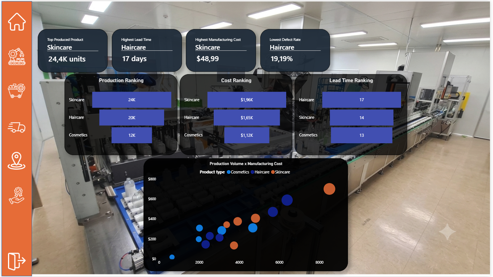
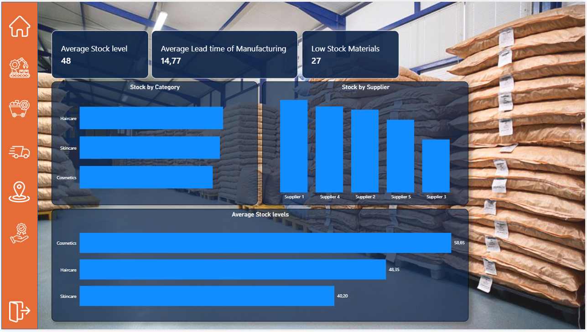
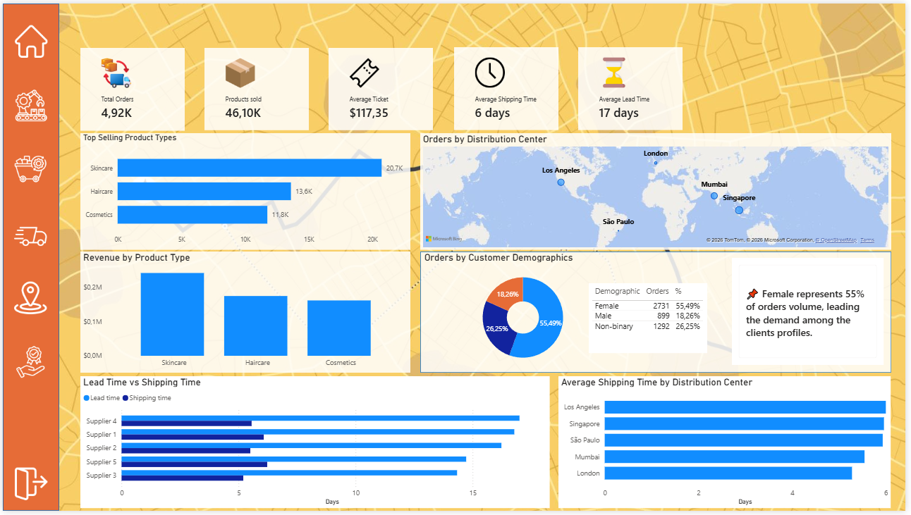
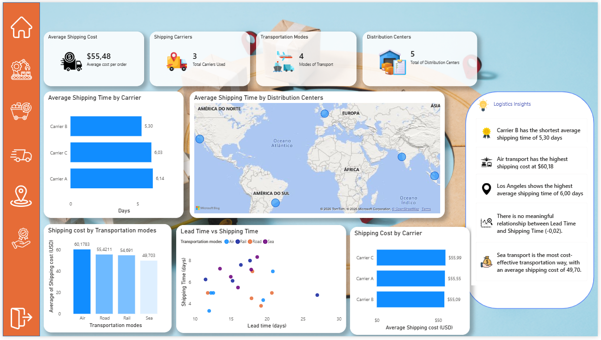
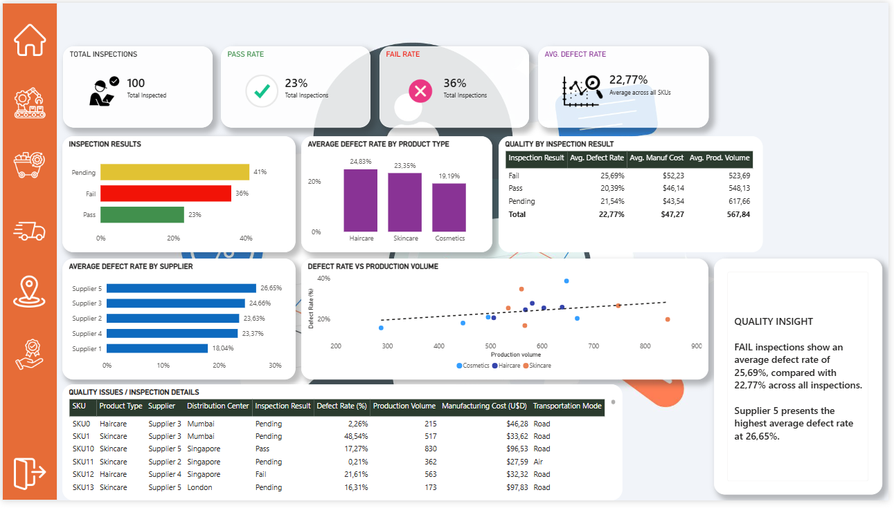

# Cosmetics Supply Chain Dashboard

Power BI dashboard developed to analyze the main operational indicators of a cosmetics supply chain, covering manufacturing, feedstock, order management, logistics, and quality control.

The project focuses on transforming supply chain data into business-oriented insights through interactive data visualization and analytical KPIs.

---

## 📊 Project Overview

This project presents a comprehensive analysis of a cosmetics supply chain using Microsoft Power BI.

The dashboard was designed to provide different perspectives of the operation, from production and raw material availability to order management, logistics performance, and product quality.

The analysis is organized into six main pages:

1. **Home**
2. **Manufacturing**
3. **Feedstock**
4. **Order Management**
5. **Logistics**
6. **Quality and Control**

The project was developed as a **Power BI analytics project**, without external system integrations, APIs, automation workflows, or external data pipelines.

---

## 🎯 Business Objectives

The main objectives of the dashboard are:

- Monitor production performance.
- Analyze manufacturing costs and lead times.
- Evaluate raw material stock levels.
- Analyze order volume and revenue.
- Compare distribution centers and transportation methods.
- Evaluate shipping times and costs.
- Monitor inspection results and defect rates.
- Identify suppliers and product categories with higher quality issues.
- Support operational decision-making through data visualization.

---

## 🛠️ Technologies

- **Microsoft Power BI**
- **Power Query**
- **DAX**
- Data visualization
- Business Intelligence
- Supply Chain Analytics

---
## 📷 Dashboard Pages












---
## 📁 Repository Structure
cosmetics-supply-chain-dashboard/
│
├── README.md
│
├── dashboard/
│   └── cosmetics-supply-chain-dashboard.pbix
│
├── screenshots/
│   ├── home.png
│   ├── manufacturing.png
│   ├── feedstock.png
│   ├── order-management.png
│   ├── logistics.png
│   └── quality-and-control.png
│
    
## 📁 Dashboard Structure

### 1. Home

Provides a high-level overview of the supply chain operation.

Main indicators include:

- Production volume
- Stock levels
- Manufacturing costs
- Production yield
- Inventory availability
- Revenue
- Operational health
- Production by product type
- Manufacturing cost by supplier
- Orders by supplier
- Production volume vs. manufacturing cost
- Manufacturing lead time

The page is designed as an executive overview before exploring the more detailed analytical pages.

---

### 2. Manufacturing

Focuses on production performance and manufacturing efficiency.

#### Main indicators

- Top produced product
- Highest manufacturing lead time
- Highest manufacturing cost
- Production volume
- Manufacturing cost
- Manufacturing lead time

#### Main analyses

- Production ranking by product type
- Manufacturing cost ranking
- Lead time ranking
- Production volume vs. manufacturing cost
- Manufacturing performance by product type

The analysis allows comparison between **production volume, manufacturing costs, and production lead time** across different product categories.

---

### 3. Feedstock

Focuses on raw material availability and manufacturing inputs.

#### Main indicators

- Average stock level
- Average manufacturing lead time
- Low-stock materials

#### Main analyses

- Stock by product category
- Stock by supplier
- Average stock levels by product type

This page provides an overview of inventory availability and potential raw material constraints.

---

### 4. Order Management

Analyzes order activity, sales distribution, products, and customer demographics.

#### Main indicators

- Total orders
- Average ticket
- Products sold

#### Main analyses

- Top-selling product types
- Orders by distribution center
- Revenue by product type
- Orders by customer demographics

The dashboard shows that **Skincare is the leading product category in sales volume**, with 20.7K products sold. Female customers represent the largest share of orders, accounting for 55.49% of the total order volume.

---

### 5. Logistics

Analyzes transportation performance, shipping costs, distribution centers, and carriers.

#### Main indicators

- Average shipping time
- Average manufacturing lead time
- Average shipping cost
- Number of shipping carriers
- Number of transportation modes
- Number of distribution centers

#### Main analyses

- Shipping time by carrier
- Shipping time by distribution center
- Shipping cost by transportation mode
- Shipping cost by carrier
- Lead time vs. shipping time

#### Key insights

- **Carrier B** has the shortest average shipping time at **5.30 days**.
- **Air transportation** has the highest average shipping cost at **$60.18**.
- **Los Angeles** has the highest average shipping time at **6.00 days**.
- **Sea transportation** has the lowest average shipping cost at **$49.70**.
- The analysis found no meaningful relationship between lead time and shipping time, with a correlation of approximately **-0.02**.

---

### 6. Quality and Control

Focuses on inspection results, defect rates, production quality, and supplier performance.

#### Main indicators

- Total inspections
- Pass rate
- Fail rate
- Average defect rate

#### Main analyses

- Inspection results
- Average defect rate by product type
- Quality by inspection result
- Average defect rate by supplier
- Defect rate vs. production volume
- Inspection and SKU-level quality details

#### Key insights

- The dataset contains **100 inspections**.
- **23%** of inspections passed.
- **36%** of inspections failed.
- **41%** of inspections are pending.
- The average defect rate is **22.77%**.
- Failed inspections have an average defect rate of **25.69%**.
- **Supplier 5** presents the highest average defect rate at **26.65%**.
- **Haircare** has the highest average defect rate among the product categories at **24.83%**.

---

## 📈 Key Business Insights

The dashboard highlights several relevant operational patterns:

### Production

**Skincare** is the highest-volume product category, with approximately **24.4K units produced**.

### Manufacturing

**Haircare** has the highest average manufacturing lead time at approximately **17 days**.

### Inventory

The analysis identifies **27 low-stock materials**, highlighting potential areas for inventory monitoring.

### Orders

Skincare is also the leading product category in terms of products sold, with approximately **20.7K units**.

### Logistics

Sea transportation presents the lowest average shipping cost, while air transportation presents the highest.

### Quality

Supplier 5 has the highest average defect rate, while failed inspections are associated with a higher average defect rate than the overall inspection population.

---

## 🧠 Analytical Approach

The project follows a business-oriented BI workflow:

```text
Raw Supply Chain Data
        ↓
Data Preparation
        ↓
Power BI Data Model
        ↓
DAX Measures
        ↓
KPIs & Visualizations
        ↓
Business Insights
