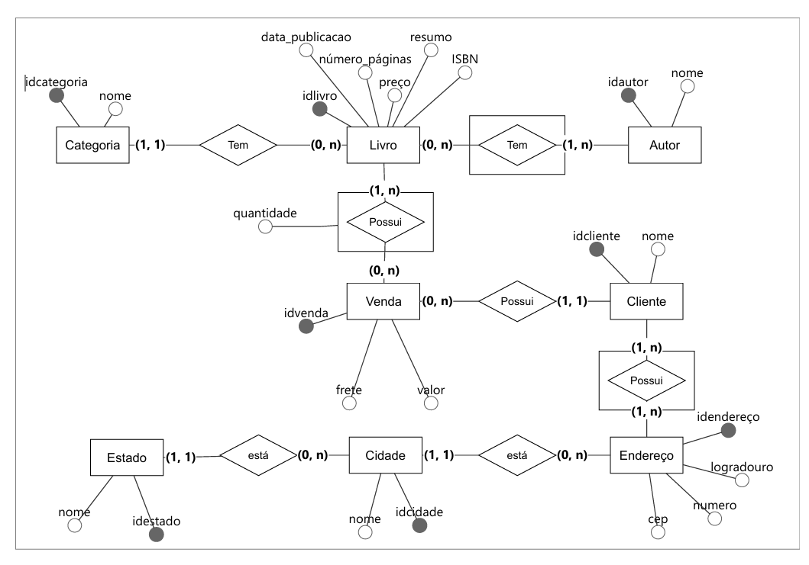
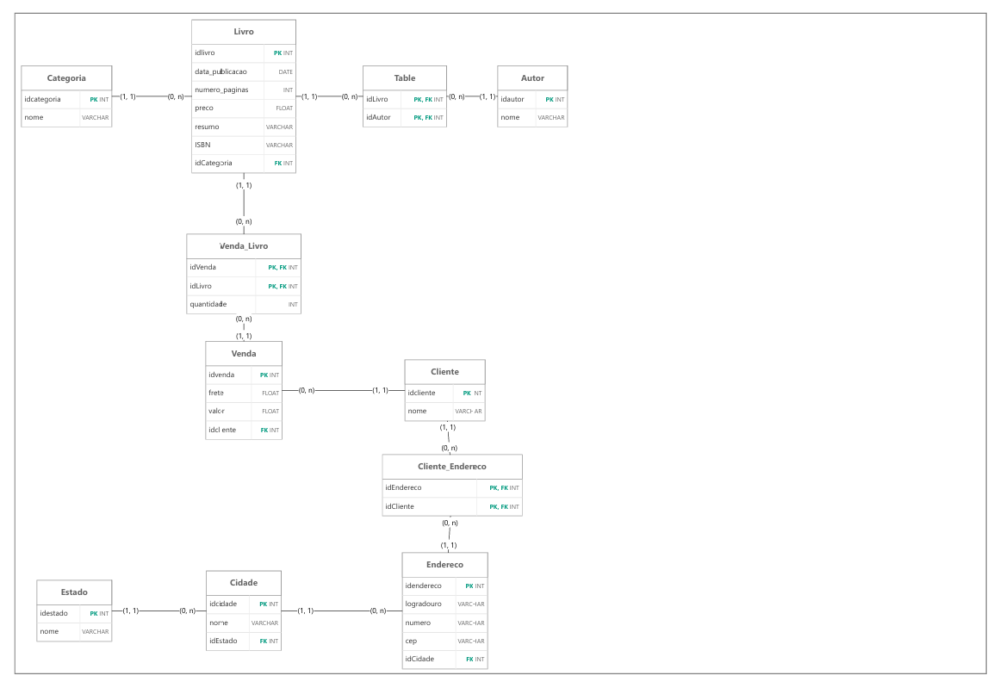

# Database Modeling — Bookstore

## 📌 About the Project

This project presents the **conceptual and logical modeling of a relational database for a bookstore system**.

The database was designed to represent the main entities involved in the bookstore's operations, including books, authors, categories, customers, addresses, and sales.

The project focuses exclusively on **database modeling**, without implementing the database or developing SQL queries.

---

## 🎯 Objectives

The main objective of this project is to demonstrate the application of relational database modeling concepts, including:

* Entity identification
* Attribute definition
* Relationships between entities
* Cardinality
* Primary Keys (PK)
* Foreign Keys (FK)
* One-to-many (1:N) relationships
* Many-to-many (N:N) relationships
* Associative tables
* Transformation from conceptual to logical modeling

---

## 🗂️ Database Structure

The proposed database contains the following entities:

### Main Entities

* **Categoria** — stores book categories.
* **Livro** — stores information about books.
* **Autor** — stores authors associated with books.
* **Cliente** — stores customer information.
* **Venda** — represents book sales.
* **Endereço** — stores customer address information.
* **Cidade** — stores cities associated with addresses.
* **Estado** — stores states associated with cities.

### Associative Entities

* **Table** — establishes the many-to-many relationship between books and authors.
* **Venda_Livro** — establishes the relationship between sales and books and stores the quantity of books included in each sale.
* **Cliente_Endereco** — establishes the relationship between customers and addresses.

---

## 🔗 Relationships

The model contains different types of relationships.

### Livro — Categoria

A category can contain multiple books, while each book belongs to a category.

**Relationship:** `1:N`

### Livro — Autor

A book can have multiple authors, and an author can be associated with multiple books.

**Relationship:** `N:N`

This relationship is resolved through the associative entity **Table**.

### Venda — Livro

A sale can contain multiple books, and a book can be included in multiple sales.

**Relationship:** `N:N`

This relationship is resolved through **Venda_Livro**, which also stores the quantity of each book in the sale.

### Cliente — Endereço

A customer can be associated with multiple addresses, while an address can be associated with multiple customers according to the proposed model.

**Relationship:** `N:N`

This relationship is represented by **Cliente_Endereco**.

### Endereço — Cidade

Each address is associated with a city, while a city can contain multiple addresses.

**Relationship:** `N:1`

### Cidade — Estado

Each city is associated with a state, while a state can contain multiple cities.

**Relationship:** `N:1`

---

## 🧩 Conceptual Model

The conceptual model represents the database entities, their attributes, relationships, and cardinalities at a high level.



> The original conceptual model is available in the `conceptual-model` directory.

---

## 🗃️ Logical Model

The logical model translates the conceptual structure into relational tables, defining primary keys, foreign keys, and associative tables.



The logical model includes:

* Primary keys (`PK`)
* Foreign keys (`FK`)
* Composite keys in associative tables
* Data types
* Relationships between tables

---

## 📁 Project Structure

```text
bookstore-database-modeling/
│
├── conceptual-model/
│   └── conceptual_model.pdf
│
├── logical-model/
│   └── logical_model.pdf
│
└── README.md
```

---

## 🛠️ Concepts Applied

| Concept              | Application                                                   |
| -------------------- | ------------------------------------------------------------- |
| Entity modeling      | Bookstore domain entities                                     |
| Attributes           | Properties associated with each entity                        |
| Cardinality          | Definition of relationship participation                      |
| Primary Key          | Unique identification of records                              |
| Foreign Key          | Relationships between tables                                  |
| 1:N relationships    | Category, City and State relationships                        |
| N:N relationships    | Book–Author and Sale–Book                                     |
| Associative entities | Resolution of N:N relationships                               |
| Logical modeling     | Transformation of the conceptual model into relational tables |

---

## 📚 Project Scope

This project focuses on **database design and modeling**.

SQL implementation, data insertion, database manipulation, and analytical queries are intentionally not included, as these concepts are explored separately in other projects within the portfolio.

---

## 📄 Models

* [Conceptual Model](conceptual-model/conceptual_model.pdf)
* [Logical Model](logical-model/logical_model.pdf)

---

## 👤 Author

**Brenno Matos**

Chemical Engineering | Data Science | SQL | Python | Power BI

[GitHub](https://github.com/brennopi)
